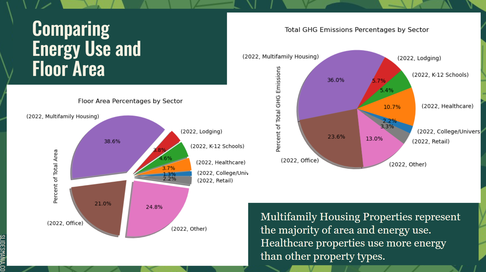
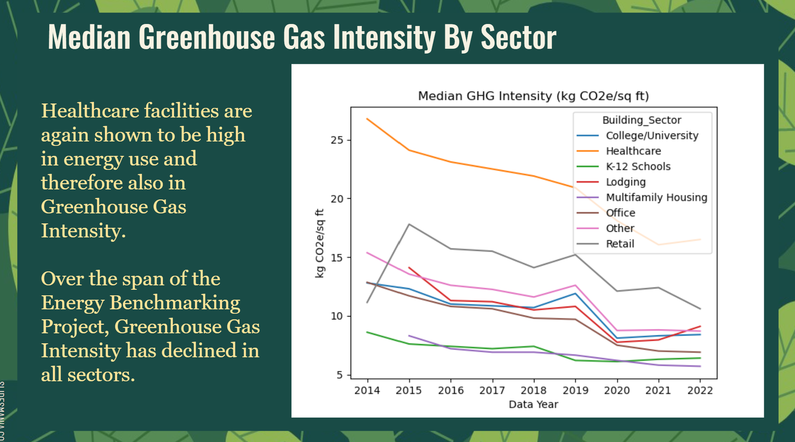
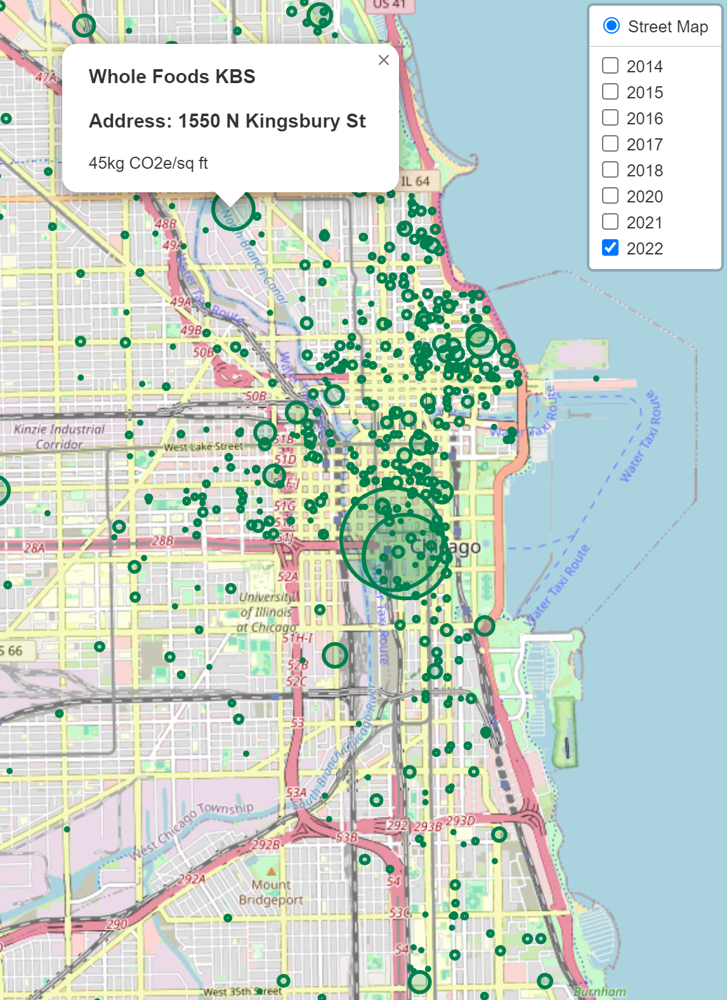

# ChicagoEnergyMapping

Using data obtained from Chicago Data Portal, we analyzed the data from the Chicago Benchmarking program. This program was adopted in 2013 in order to raise awarness and improve energy use in the city. This ordinace, from 2016, requires building over 50,000sqft to report energy usage. Using the data from csv(approx. 25,000), we analyzed the data and created visuals with different libraries Matoplotlib, Seaborn, Tabulate, React and Chackra UI. The visualization did demonstate on overall downward trend in energy consumption in all different building types.

We also produced an interactive map showing circle markers for buldings.  The size of the circle relates to the amount of energy use, and clicking on a circle provides a popup with the name, address, and equivalent CO2 emissions for the building. The interactive map is live at https://bluffermk.github.io/ChicagoEnergyMapping/ .

Ethical Considerations: Ethical considerations taken on this project is the fairness and being mindful of potential biases, if the data is coming from specific neighborhoods and not repersenting the city of Chicago as a whole. With the data being primarily focused on buildings of a larger size, the neighboorhoods that make the most improvement would be the ones who have the largest number of buildings. Also privacy is important for in each row the address of the building is shown and can lead to the name of the owners to be easily found.

Energy Benchmarking data from
https://data.cityofchicago.org/Environment-Sustainable-Development/Chicago-Energy-Benchmarking/xq83-jr8c/about_data

Images from Summary

Our Presentation link is  https://docs.google.com/presentation/d/18dOP0bXBT_8LM8jy8dI2MLsIdmEEMJKAO7BeDf5_GzQ/edit#slide=id.g2cd900633f9_0_211

